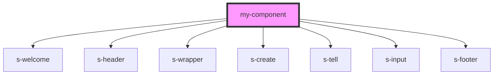

# my-component

<!-- Auto Generated Below -->

## Dependencies

### Depends on

- [s-welcome](../s-welcome)
- [s-header](../s-header)
- [s-wrapper](../s-wrapper)
- [s-create](../s-create)
- [s-tell](../s-tell)
- [s-input](../s-input)
- [s-footer](../s-footer)

### Graph

----------------------------------------------

*Built with [StencilJS](https://stenciljs.com/)*
