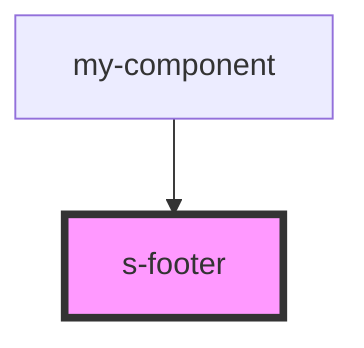

# s-footer

<!-- Auto Generated Below -->

## Properties

| Property    | Attribute    | Description                        | Type        | Default     |
| ----------- | ------------ | ---------------------------------- | ----------- | ----------- |
| `forFooter` | `for-footer` |                                    | `any`       | `undefined` |
| `intro`     | --           | Приём данных из массива для вывода | `SFooter[]` | `[]`        |

## Events

| Event                | Description     | Type               |
| -------------------- | --------------- | ------------------ |
| `clickFooterPrivacy` | Клип по privacy | `CustomEvent<any>` |
| `clickFooterSubText` | Клип по subtext | `CustomEvent<any>` |
| `clickFooterSupport` | Клип по text    | `CustomEvent<any>` |
| `clickFooterText`    | Клип по text    | `CustomEvent<any>` |

## Dependencies

### Used by

 - [my-component](../my-component)

### Graph

----------------------------------------------

*Built with [StencilJS](https://stenciljs.com/)*
