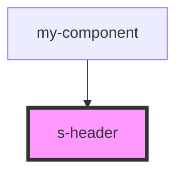

# s-header

<!-- Auto Generated Below -->

## Properties

| Property    | Attribute    | Description                        | Type        | Default     |
| ----------- | ------------ | ---------------------------------- | ----------- | ----------- |
| `forHeader` | `for-header` |                                    | `any`       | `undefined` |
| `intro`     | --           | Приём данных из массива для вывода | `SHeader[]` | `[]`        |

## Events

| Event               | Description      | Type               |
| ------------------- | ---------------- | ------------------ |
| `clickHeaderImage`  | Клип по картинке | `CustomEvent<any>` |
| `clickHeaderLogIn`  | Клип по slog in  | `CustomEvent<any>` |
| `clickHeaderSignUp` | Клип по sign up  | `CustomEvent<any>` |

## Dependencies

### Used by

 - [my-component](../my-component)

### Graph

----------------------------------------------

*Built with [StencilJS](https://stenciljs.com/)*
