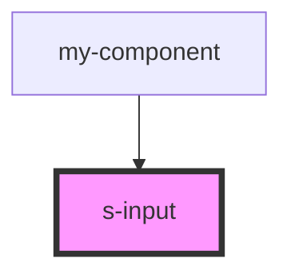

# s-input

<!-- Auto Generated Below -->

## Properties

| Property   | Attribute   | Description                        | Type       | Default     |
| ---------- | ----------- | ---------------------------------- | ---------- | ----------- |
| `forInput` | `for-input` |                                    | `any`      | `undefined` |
| `intro`    | --          | Приём данных из массива для вывода | `SInput[]` | `[]`        |

## Events

| Event              | Description    | Type               |
| ------------------ | -------------- | ------------------ |
| `clickInput`       | Клип по Input  | `CustomEvent<any>` |
| `clickInputButton` | Клип по кнопке | `CustomEvent<any>` |
| `clickInputText`   | Клип по тексту | `CustomEvent<any>` |

## Dependencies

### Used by

 - [my-component](../my-component)

### Graph

----------------------------------------------

*Built with [StencilJS](https://stenciljs.com/)*
