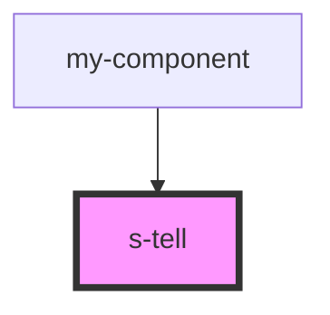

# s-tell

<!-- Auto Generated Below -->

## Properties

| Property  | Attribute  | Description                        | Type      | Default     |
| --------- | ---------- | ---------------------------------- | --------- | ----------- |
| `forTell` | `for-tell` |                                    | `any`     | `undefined` |
| `intro`   | --         | Приём данных из массива для вывода | `STell[]` | `[]`        |

## Events

| Event                  | Description         | Type               |
| ---------------------- | ------------------- | ------------------ |
| `clickTellAppImage`    | Клик по AppImage    | `CustomEvent<any>` |
| `clickTellGoogleImage` | Клик по GoogleImage | `CustomEvent<any>` |
| `clickTellSubText`     | Клик по subtext     | `CustomEvent<any>` |
| `clickTellText`        | Клик по тексту      | `CustomEvent<any>` |
| `clickTellTitle`       | Клик по title       | `CustomEvent<any>` |

## Dependencies

### Used by

 - [my-component](../my-component)

### Graph

----------------------------------------------

*Built with [StencilJS](https://stenciljs.com/)*
