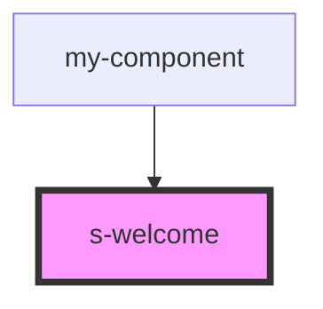

# s-welcome

<!-- Auto Generated Below -->

## Properties

| Property     | Attribute     | Description                        | Type         | Default     |
| ------------ | ------------- | ---------------------------------- | ------------ | ----------- |
| `forWelcome` | `for-welcome` |                                    | `any`        | `undefined` |
| `intro`      | --            | Приём данных из массива для вывода | `SWelcome[]` | `[]`        |

## Events

| Event               | Description        | Type               |
| ------------------- | ------------------ | ------------------ |
| `clickWelcomeImage` | Клик по картинке   | `CustomEvent<any>` |
| `clickWelcomeText`  | Клик по под тексту | `CustomEvent<any>` |
| `clickWelcomeTitle` | Клик по тексту     | `CustomEvent<any>` |

## Dependencies

### Used by

 - [my-component](../my-component)

### Graph

----------------------------------------------

*Built with [StencilJS](https://stenciljs.com/)*
